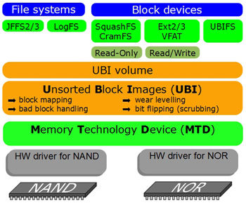

UBIFS
====

**无排序区块图像文件系统(Unsorted Block Image File System, UBIFS)**是用于固态硬盘存储设备上，并与LogFS相互竞争，作为JFFS2的后继文件系统之一。    
真正开始开发于2007年，并于2008年10月第一次加入稳定版本于Linux核心2.6.27版。   

----

###产生背景

FLASH具有的“先擦除再写入”、坏块、“有限的读写次数”等特性，目前管理FLASH的方法主要有：

1. 采用MTD+FTL／NFTL（flash 转换层／nand flash转换层）＋ 传统文件系统，如：FAT、ext2等。    
FTL／NFTL的使用就是针对FLASH的特有属性，通过软件的方式来实现日志管理、坏块管理、损益均衡等技术。但实践证明，由于知识产权、效率等各方面因素导致本方案有一定的局限性。

2. 采用硬件翻译层+传统文件系统的方案。这种方法被很多存储卡产品采用，如：SD卡、U盘等。   
	这种方案对于一些产品来说，成本较高。

3. 采用MTD+ FLASH专用文件系统，如JFFS1／2，YAFFS1/2等。它们大大提高了FLASH的管理能力，并被广泛应用。

**JFFS2、YAFFS2等专用文件系统也存在着一些技术瓶颈，如：内存消耗大，对FLASH容量、文件系统大小、内容、访问模式等的线性依赖，损益均衡能力差或过渡损益等。   
在此背景下内核加入了UBI文件系统的支持。**

UBIFS最早在2006年由IBM与Nokia的工程师Thomas Gleixner，Artem Bityutskiy所设计，**专门为了解决MTD（Memory Technology Device）设备所遇到的瓶颈。**由于Nand Flash容量的暴涨，YAFFS等皆无法再去控制Nand Flash的空间。UBIFS通过子系统UBI处理与MTD device之间的动作。**与JFFS2一样，UBIFS 建构于MTD device 之上，因而与一般的block device不兼容。**

**UBIFS在设计与性能上均较YAFFS2、JFFS2更适合MLC NAND FLASH。**   
例如：UBIFS 支持 write-back, 其写入的数据会被cache, 直到有必要写入时才写到flash, 大大地降低分散小区块数量并提高I/O效率。UBIFS UBIFS文件系统目录存储在flash上，UBIFS mount时不需要scan整个flash的数据来重新创建文件目录。支持on-the-flight压缩文件数据，而且可选择性压缩部分文件。另外UBIFS使用日志（journal），可减少对flash index的更新频率。

其中，UBI是一种类似于LVM的逻辑卷管理层。主要实现损益均衡，逻辑擦除块、卷管理，坏块管理等。而UBIFS是一种基于UBI的FLASH日志文件系统。    
一句话解读就是，**UBIFS及其使用的UBI子系统，是一种用在大容量flash上的文件系统。**

###UBI/UBIFS的特点
1. 可扩展性    
	UBIFS对flash 尺寸有着很好的扩展性；也就是说mount时间、内存消耗以及I/O速度都不依赖于flash 尺寸（对于内存消耗并不是完全准确的，但是依赖性非常的低）；
2. 快速mount     
	不像JFFS2，UBIFS在mount阶段不需要扫描整个文件系统，UBIFS mount介质的时间只是毫秒级，时间不依赖与flash的尺寸；然而UBI的初始化时间是依赖flash的尺寸的，因此必须把这个时间考虑在内。
3. write-back 支持     
	UBIFS的回写（延迟写）同JFFS2的write-through(立即写入内存)相比可以显著地提高文件系统的吞吐量。
4. 异常unmount适应度   
	UBIFS是一个日志文件系统，可以容忍突然掉电以及unclean重启； UBIFS 通过replay 日志来恢复unclean unmount，在这种情况下replay会消耗一些时间，因此mount时间会稍微增加，但是replay过程并不会扫描整个flash介质，所以UBIFS的mount时间大概在几分之一秒。  
5. 快速I/O     
6. on-the_flight compression     
7. 可恢复性    
8. 完整性    
	UBIFS通过写checksum到flash 介质上来保证数据的完整性
	
###UBI/UBIFS的层次结构

* UBIFS是工作在UBI子系统之上的。
* UBI没有FLASH转换成（FTL，Flash Translation Layer）。
* 因为没有FTL，所以UBI只能工作在裸的flash，因此，它不能用于消费类FLASH，如MMC, RS-MMC, eMMC, SD, mini-SD, micro-SD, CompactFlash, MemoryStick等，UBI在嵌入式设备如智能手机中被广泛使用。

----

#UBI文件系统制作

###添加内核支持
Linux Kernel - menuconfig

* Enabling UBI support on MTD devices.

		Device Drivers --->
			Memory Technology Device (MTD) support --->
				Enable UBI - Unsorted block images 
* Enabling UBIFS file-system support.

		File systems  --->
			Miscellaneous filesystems  --->
				UBIFS file system support

----

参考:

* [WiKi-UBIFS](https://zh.wikipedia.org/wiki/UBIFS)   
* [UBI文件系统详细介绍](http://velep.com/archives/909.html)
* 